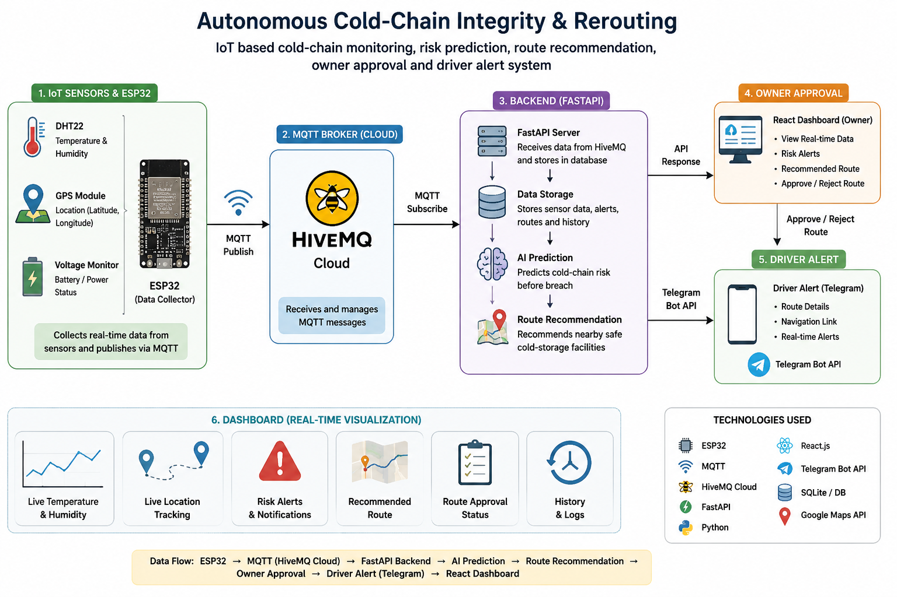
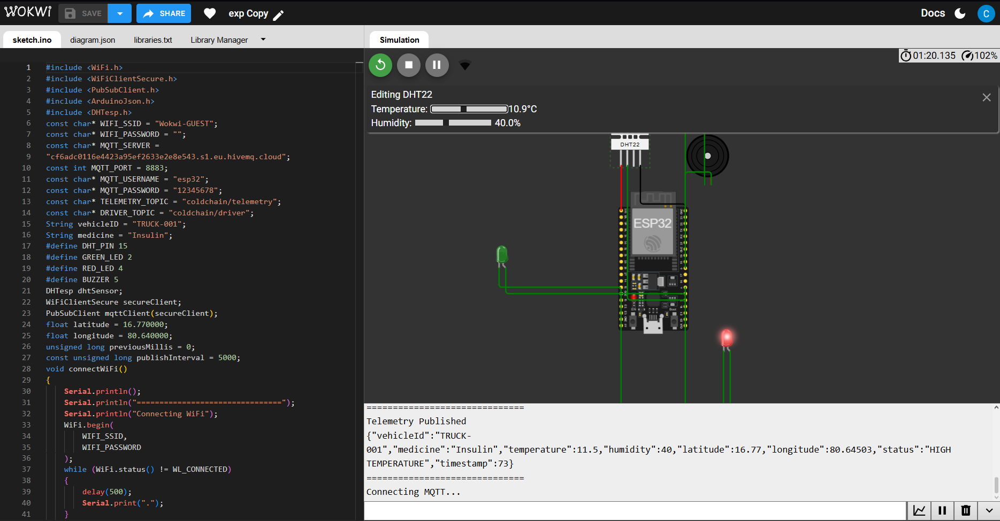
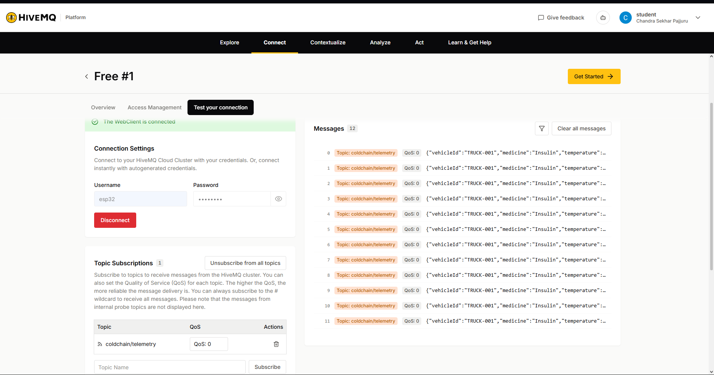
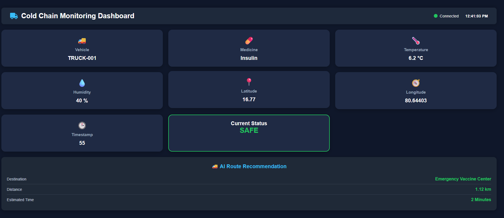
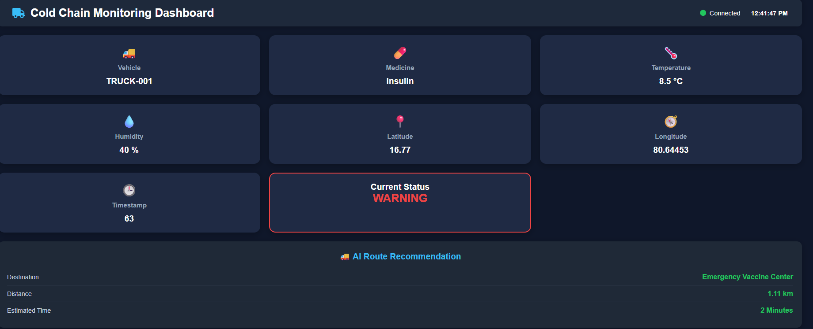
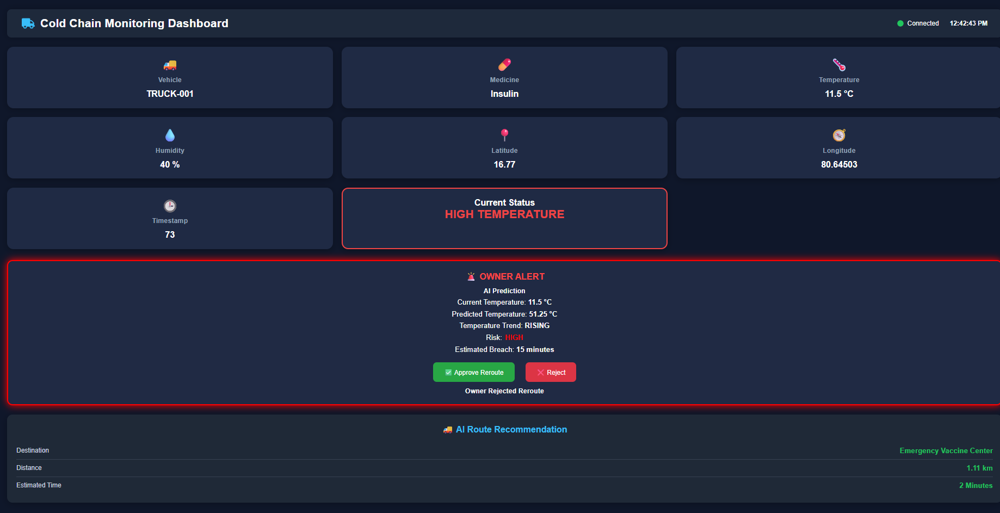
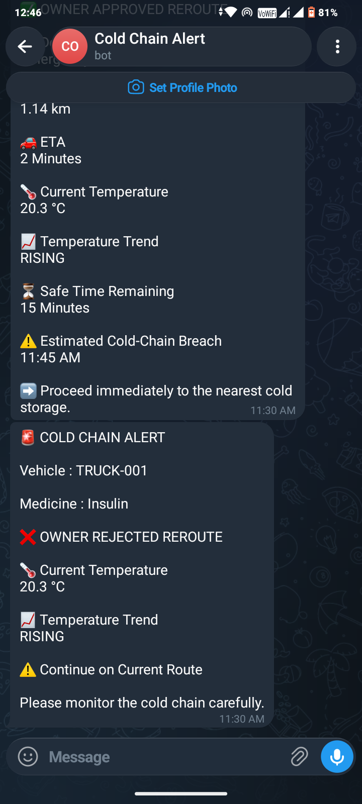

# Autonomous Cold-Chain Integrity & Rerouting

An IoT-based cold-chain monitoring prototype for monitoring temperature, humidity and vehicle location, predicting cold-chain risk, recommending nearby cold-storage facilities, obtaining owner reroute approval and sending driver alerts through Telegram.

## Technologies

- ESP32
- Wokwi
- MQTT
- HiveMQ Cloud
- FastAPI
- Python
- React
- Vite
- Telegram Bot API

## System Flow

ESP32/Wokwi → MQTT → HiveMQ Cloud → FastAPI Backend → React Dashboard

AI Prediction → Route Recommendation → Owner Approval → Driver Alert

## Project Status

Prototype / Demonstration
## System Architecture

## Demonstration

### Wokwi + ESP32 Simulation

### HiveMQ Cloud

### Safe Condition

### Warning Condition

### High Temperature Alert

### Owner Approval

### Route Rejection

